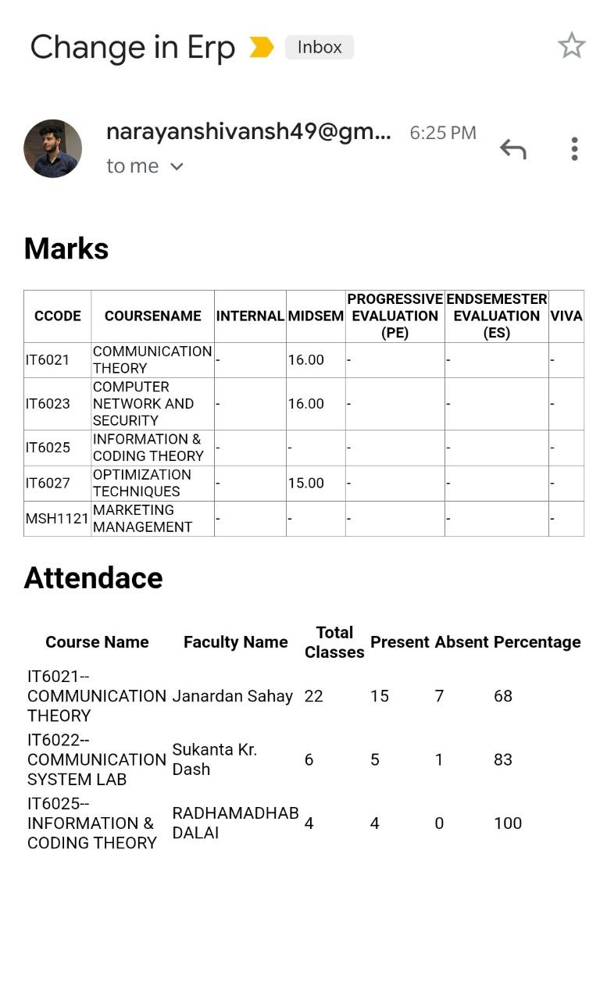

# erp-notify

This flask app will send an email whenever there is an update in marks or attendance in ERP

## Installation

1. Clone the repo
2. ```pip3 install -r requirements.txt``` in the project directory

## Usage

1. In ```constants.py``` change the following
```
 13 'txt_username': 'BE/10600/17',
 14 'txt_password': '***REMOVED***'
```
2. In ```send.py``` modify the following

```python
strFrom = 'narayanshivansh49@gmail.com'
strTo = 'narayanshivansh49@gmail.com'
```
```
smtp.login('narayanshivansh49@gmail.com', '***REMOVED***')
```
4. In the project directory run to start the flask app ```python3 app.py```

## Built With

* [Flask]() - The web framework used
* [Teseract](https://github.com/tesseract-ocr/tesseract) - ocr for Captcha
* [requests]() - Python Library for creating sessions and sending post request for log-in

## Screenshots

